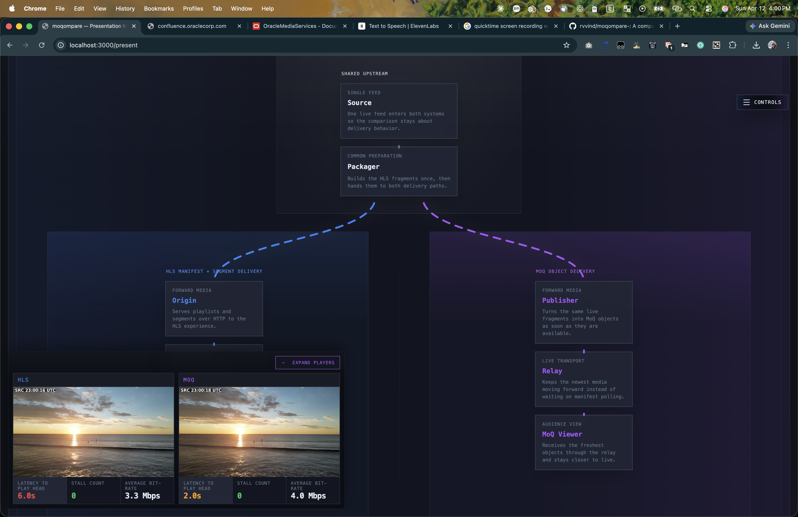
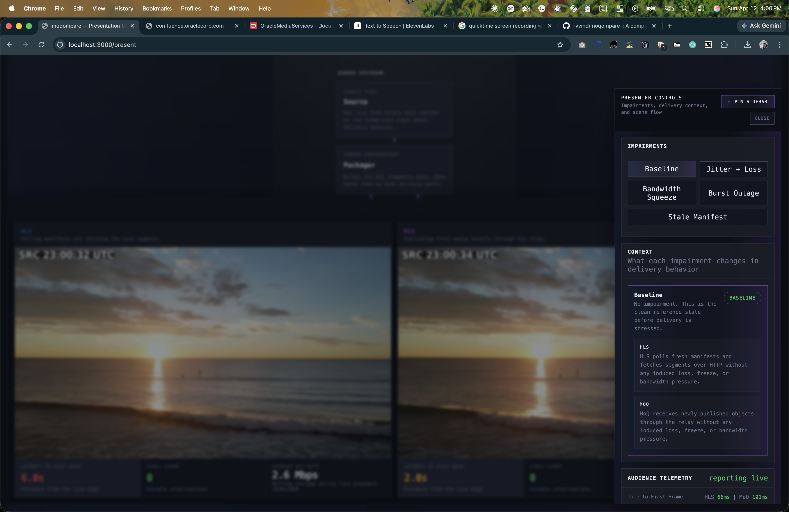
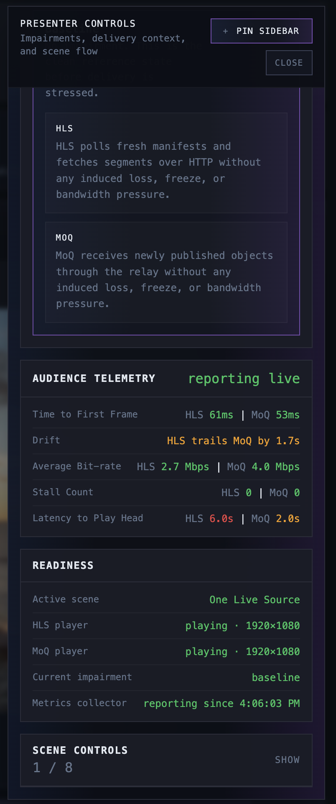

# moqompare

**Side-by-side live video comparison lab for HLS and MoQ**

moqompare runs the same live video through two delivery paths simultaneously — HLS over HTTP and MoQ over QUIC — and lets you observe, measure, and stress-test how each protocol behaves under identical conditions.

---

## What it does

Put a live stream in front of an audience and flip between network conditions in real time. Watch HLS poll its way through a manifest freeze while MoQ keeps playing. Drop bandwidth and see each protocol's ABR logic kick in at a different threshold. Induce packet loss and compare how TCP congestion collapse differs from QUIC recovery.

Everything runs locally in Docker. No cloud account, no special hardware.

---

## Screenshots

### Side-by-side comparison

The main view plays both streams simultaneously with a live metrics bar above each player. The UTC timestamp burned into the source frame makes latency drift visible at a glance. The event timeline below logs every impairment transition and player state change.


> HLS at 6.0 s latency on the low rendition; MoQ at 2.0 s on the high rendition — same source, two seconds apart.

---

### Presentation workspace

A dedicated single-screen view for live demos. A live architecture map shows the active delivery path with animated flow indicators. The presenter controls rail lets you apply impairments and advance the narrative without leaving the screen.






The audience telemetry panel shows live startup times, latency-to-play-head, drift, bitrate, and stall counts for both protocols side by side — updated every 2 seconds.



---

### Fan-out simulation

Scale up to 4, 6, 9, or 16 concurrent MoQ subscribers with a single click and watch every player report sub-second startup times with zero stalls.


---

## Key features

**One source, two delivery paths**  
The same FFmpeg-encoded video enters both HLS and MoQ so every difference you observe is about delivery, not content.

**Live impairment injection**  
Five profiles applied on demand via `tc netem` inside running containers — no service restart, no configuration change:

| Profile | What it does |
|---------|--------------|
| Baseline | Clean reference state |
| Jitter + Loss | 30 ms ± 20 ms delay, 1% packet loss |
| Bandwidth Squeeze | 500 kbit/s rate cap |
| Burst Outage | 100% loss for 5 s, then clear |
| Stale Manifest | Freezes the HLS manifest; MoQ is unaffected |

**ABR on both paths**  
Dual renditions (hi @ 1080p / lo @ 360p) with independent ABR logic: hls.js manages HLS level switching while MoQ uses a bandwidth-aware controller that follows hls.js estimates.

**Presentation mode**  
`/present` is a purpose-built single-screen workspace with a live architecture map, scene flow, shared telemetry cards, and a slide-out controls rail. Drive a demo without opening developer tools.

**Fan-out simulation**  
Spin up N concurrent MoQ subscribers via a Docker Compose profile and observe aggregate startup time and stall counts across the group.

**Prometheus metrics**  
Browser-pushed metrics available at `:9090/metrics` and `:9090/snapshot`. Startup time, live latency, stall count, and bitrate for both protocols, updated every 5 seconds.

**Automated comparison report**  
`scripts/report.sh` cycles through all impairment profiles, captures metrics at each step, and writes a Markdown table comparing HLS vs MoQ latency, stalls, and bitrate under each condition.

---

## Architecture

```
  source (FFmpeg: looped /videos/*.mp4 or testsrc2 + UTC timestamp)
      │  MPEG-TS via named pipe
  packager (FFmpeg: dual-rendition fMP4 HLS)
      │
      ├─────────────────────────────────────────────┐
      │  HLS path                                   │  MoQ path
      ▼                                             ▼
  origin (nginx :8080)                  publisher-hi / publisher-lo
      │                                     │  (moq-cli, built from source)
      ▼                                     ▼
  manifest-proxy (:8091)              relay (moq-relay :4443 QUIC+TCP)
      │  optional manifest freeze           │  WebTransport
      ▼                                     ▼
  web (nginx :3000) ◄───────────────────────┘
      │  hls.js player + hang-watch MoQ player
      │  /present  — presentation workspace
      │  /fanout   — fan-out demo
      │  /impair/  → impairment API (:8090)
      └  /metrics/ → Prometheus collector (:9090)
```

| Service | Role | Port |
|---------|------|------|
| `source` | FFmpeg source with UTC timestamp overlay | — |
| `packager` | Dual-rendition fMP4 HLS packager | — |
| `origin` | nginx HLS segment server | 8080 |
| `manifest-proxy` | Transparent proxy with manifest freeze capability | 8091 |
| `publisher-hi/lo` | moq-cli: HLS ingest → QUIC publish | — |
| `relay` | moq-relay: QUIC relay + WebTransport | **4443** |
| `web` | nginx: UI, proxies all internal services | **3000** |
| `impairment` | `tc netem` HTTP API via nsenter | 8090 |
| `metrics` | Prometheus metrics collector | 9090 |

---

## Prerequisites

- Docker Engine 24+ with Docker Desktop or Colima
- Docker Compose (v2 plugin `docker compose` or standalone `docker-compose`)
- Internet access during first build (downloads hls.js, clones moq-rs)

If using Colima:
```sh
colima start --runtime docker
```

---

## Quick start

```sh
git clone https://github.com/rvvind/moqompare-.git
cd moqompare-

# Bootstrap: copy .env, generate cluster credentials, build images
make setup

# Start all services
make up

# Open the comparison UI
open http://localhost:3000

# Open the presentation workspace
open http://localhost:3000/present

# Open the fan-out demo
open http://localhost:3000/fanout
```

**First run note:** `make setup` pulls pre-built multi-platform images from GHCR — no Rust compilation required. All services start in seconds.

**Expected startup order:**
1. `source` → creates FIFO, begins encoding (~10 s to healthy)
2. `packager` → writes first HLS segments (~20 s to healthy)
3. `origin`, `relay`, `manifest-proxy`, `web` → come up immediately after packager
4. `publisher-hi/lo` → connect to relay, begin ingesting HLS
5. HLS plays in ~5–10 s; MoQ plays in ~10–15 s

---

## Using your own video

Place any `.mp4` files in the `videos/` directory before running `make up`. The source container loops them end-to-end with a 999-repetition pre-expanded playlist, so playback continues uninterrupted for hundreds of hours without a pipeline restart.

If `videos/` is empty, the source falls back to FFmpeg `testsrc2` (animated synthetic test pattern).

---

## Impairments

Apply from the UI, from the command line, or via the HTTP API:

```sh
# Command line
./scripts/impair.sh jitter

# HTTP API
curl -X POST http://localhost:8090/impair/squeeze

# Reset
curl -X POST http://localhost:8090/impair/baseline
```

**What each profile exposes:**

- **Jitter + Loss** — TCP halves its congestion window on every lost packet. At 1% loss, hls.js drops to the low rendition. QUIC retransmits without throughput collapse; MoQ stays on the high rendition.
- **Bandwidth Squeeze** — A 500 kbit/s cap starves TCP. hls.js switches to 640×360. MoQ's ABR controller switches from `stream_hi` to `stream_lo` once estimated bandwidth falls below 3.6 Mbps.
- **Burst Outage** — 100% loss for 5 s. HLS drains its buffer and stalls. QUIC closes and re-establishes in ~1 RTT; MoQ recovers faster.
- **Stale Manifest** — Only the HLS manifest is frozen. The segment server and the MoQ relay stay healthy. HLS stalls because it can't see new segments. MoQ is unaffected because it has no manifest to poll.

---

## Make targets

```sh
make setup     # copy .env.example → .env, generate cluster credentials, build images
make up        # start all services
make down      # stop all services
make logs      # stream logs from all services
make ps        # show container status
make clean     # stop, remove containers + volumes, prune images
```

```sh
./scripts/demo.sh              # opens browser, cycles impairments, prints metrics snapshot
./scripts/report.sh            # writes report.md with HLS vs MoQ comparison table
./scripts/impair.sh <profile>  # apply an impairment profile directly
```

**Fan-out:**
```sh
docker-compose --profile fanout up -d fanout
```

---

## Configuration

Copy `.env.example` to `.env` and adjust before running `make up`:

| Variable | Default | Description |
|----------|---------|-------------|
| `SOURCE_FPS` | `30` | Source frame rate |
| `SOURCE_RESOLUTION` | `1920x1080` | Source resolution |
| `SOURCE_BITRATE` | `4000k` | Hi-rendition bitrate |
| `HLS_SEGMENT_DURATION` | `2` | Seconds per HLS segment |
| `HLS_LIST_SIZE` | `5` | Segments kept in rolling manifest |
| `ABR_LO_BITRATE` | `500k` | Lo-rendition bitrate |
| `ABR_LO_RESOLUTION` | `640x360` | Lo-rendition resolution |
| `ORIGIN_PORT` | `8080` | HLS origin host port |
| `RELAY_PORT` | `4443` | MoQ relay host port (QUIC + TCP) |
| `WEB_PORT` | `3000` | Browser UI host port |
| `VIDEOS_DIR` | `./videos` | Directory of `.mp4` files to loop |

---

## Metrics

After both players have been running for ~5 seconds the browser begins pushing metrics:

```sh
curl http://localhost:9090/snapshot    # JSON
curl http://localhost:9090/metrics     # Prometheus
curl http://localhost:3000/metrics/snapshot  # proxied via web
```

Fields: `player_startup_ms`, `player_latency_seconds`, `player_stalls_total`, `player_bitrate_bps` — labelled by `protocol` (`hls` / `moq`) and `impairment_profile`.

---

## Troubleshooting

**No HLS video after 30 s**
```sh
docker-compose logs packager
docker-compose exec origin ls /usr/share/nginx/html/hls/
# should list master.m3u8, stream_hi.m3u8, stream_lo.m3u8
```

**MoQ shows "Waiting for broadcast" indefinitely**
```sh
docker-compose logs publisher-hi --tail=30
docker-compose logs relay --tail=30
```
If publisher logs show `catalog.json err=not found`, rebuild: `docker-compose up -d --build publisher-hi publisher-lo`

**Impairment buttons return "pid not found"**
```sh
docker-compose logs impairment | head -10
```
The impairment container needs access to the Docker socket. Verify `DOCKER_HOST` is set correctly for your Docker Desktop / Colima setup.

**Playback stalls every time videos loop**  
Ensure the source container image is current (`docker-compose build source`). Older images used `-stream_loop -1` with the concat demuxer, which causes a multi-second FIFO stall at each loop boundary. The current image pre-expands the playlist to 4995 entries so FFmpeg runs for hours without restarting.

**First `make up` takes too long**  
Run `make setup` first — it pulls pre-built images from GHCR so no compilation is needed. If you intentionally ran `make build-images`, the Rust compile for `relay` and `publisher` is expected to take a few minutes on first build.

---

## Repository layout

```
source/           Live source generator (looped mp4 or FFmpeg testsrc2 + drawtext)
packager/         FFmpeg dual-rendition fMP4 HLS packager
origin/           (nginx image, no custom code)
manifest-proxy/   Go HLS manifest proxy with freeze support
publisher/        moq-cli publisher (hi + lo renditions, built from source)
relay/            moq-relay QUIC relay (built from source)
impairment/       tc netem HTTP API (Python, privileged sidecar)
metrics/          Prometheus metrics collector (browser-push model)
fanout/           Concurrent MoQ subscriber simulation
web/
  static/
    index.html              Side-by-side comparison UI
    present.html            Presentation workspace
    present-control.html    Presenter remote control panel
    presentation/           CSS + JS modules for presentation mode
infra/            nginx configs
scripts/          setup, run, demo, impair, report scripts
docs/             Architecture notes, phase plan, impairment API reference
  screenshots/    UI screenshots
```

---

## Phase history

| Phase | Goal |
|-------|------|
| 0 | Repo skeleton, Docker Compose, placeholder containers |
| 1 | Live HLS stream in the browser with metrics |
| 2 | Same stream via MoQ alongside HLS |
| 3 | Impairment injection and event timeline |
| 4 | Full metrics and observability |
| 5 | ABR ladder — dual rendition, observable level switching |
| 6 | Subscriber fan-out simulation |
| 7 | Automated impairment comparison report |
| 8 | Presentation workspace with scene flow and live architecture map |

---

## License

Apache 2.0 — see [`LICENSE`](LICENSE).
